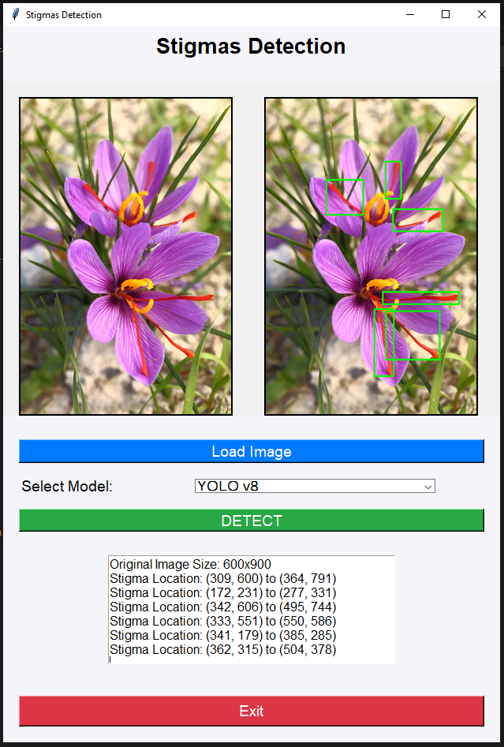

Fast and Accurate Saffron Stigma Detection Using YOLOv8

A GUI-based application for detecting  Saffron Stigma in images using YOLO-based object detection models.

1. Download the Repository
   
https://github.com/tmtgssi/TPPDLAW/

2. Install Dependencies
   
pip install -r requirements.txt

3. Download Model Checkpoints
   
https://drive.google.com/file/d/11SQEBLizDvIZ9DY342qgw6lHKjmiHILz/view?usp=sharing

4.🚀 Running the Application

python GUI.py

5. The dataset used for training and evaluation can be found at:
   
https://universe.roboflow.com/jaspreet-drxjo/saffron-teuxt

